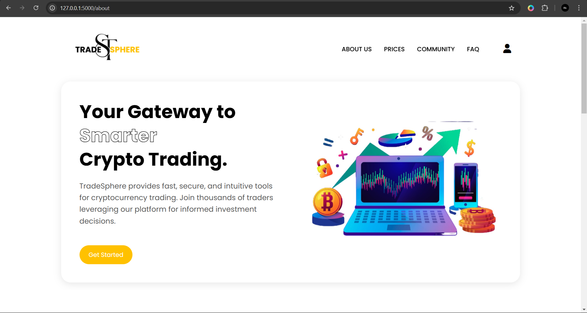

<br>
<br>
<div align="center">
    
  <br>
  A Web-based Cryptocurrency Trading and Advanced Transaction Analysis Platform
</div>

# TradeSphere - Cryptocurrency Trading Website

## Project Overview

TradeSphere is a cryptocurrency trading platform that provides advanced transaction analysis and trading functionalities. It includes features like wallet management, price updates, user authentication, and facial recognition as a security measure.

## Project Structure

```
TradeSphere/
│── app.py                   # Main application file
│── wallet.py                # Wallet functionality
│── price_updater.py         # Updates cryptocurrency prices
│── insert_dummy_users.py    # Inserts test users into the database
│── insert_wallet_data.py    # Inserts wallet data
│── update_wallet_totals.py  # Updates wallet totals
│── static/                  # CSS, JavaScript, images
│── templates/               # HTML templates
│── instance/                # Contains SQLite database files/configs
```

## Setup Instructions

### 1. Clone the Repository

```sh
git clone https://github.com/your-username/TradeSphere.git
cd TradeSphere
```

### 2. Create a Virtual Environment (Optional but Recommended)

```sh
python -m venv venv
source venv/bin/activate   # On macOS/Linux
venv\Scripts\activate      # On Windows
```

### 3. Install Dependencies

```sh
pip install -r requirements.txt
```

#### If `dlib` or `cmake` fails, install them manually:

**Windows:**
```sh
pip install cmake dlib
```
(If issues arise, install [Visual Studio Build Tools](https://visualstudio.microsoft.com/visual-cpp-build-tools/) first.)

**Linux:**
```sh
sudo apt update && sudo apt install -y cmake libboost-all-dev
pip install dlib
```

**macOS:**
```sh
brew install cmake
pip install dlib
```

### 4. Set Up the Database

```sh
python insert_dummy_users.py
python insert_wallet_data.py
python update_wallet_totals.py
```

### 5. Run the Application

```sh
python app.py
```

Then open `http://127.0.0.1:5000/` in your browser.

## Technologies Used

- **Security:** Facial Recognition
- **Database:** SQLite3
- **Development Stack:** HTML, CSS, JavaScript
- **APIs Used:** CoinGecko, Binance

## Website Pages Overview

### Homepage  


  
*The homepage provides an overview of the platform with navigation options.*  

### About Us  


  
*Details about TradeSphere and its mission.*  

### Prices Page  
  
*Live cryptocurrency price tracking and market trends.*  

### FAQ Page  
  
*Frequently asked questions about the platform.*  

### Login & Signup  

  
*User authentication with face verification.*  

### Dashboard  
  
*Overview of user activity, portfolio, and market trends.*  

### Wallet  
  
*Displays user balances, transaction history, and deposit/withdrawal options.*  

### Trade  
  
*Trading interface for buying and selling cryptocurrencies with market insights.*  

### Community  
  
*Interactive forum and social features for traders to connect and share insights.*  

### Insights  
  
*Real-time analytics and AI-powered market predictions.*  

### Settings  
  
*User preferences, security settings, and account management.*  

---

**Navigation Details (Before Login & Dashboard Access):**  
- The **logo in the header** redirects to the homepage.  
- The **"Learn More" and "Join Us" buttons** redirect to the login page.  
- After logging in, **face verification** is required before accessing the dashboard.  
